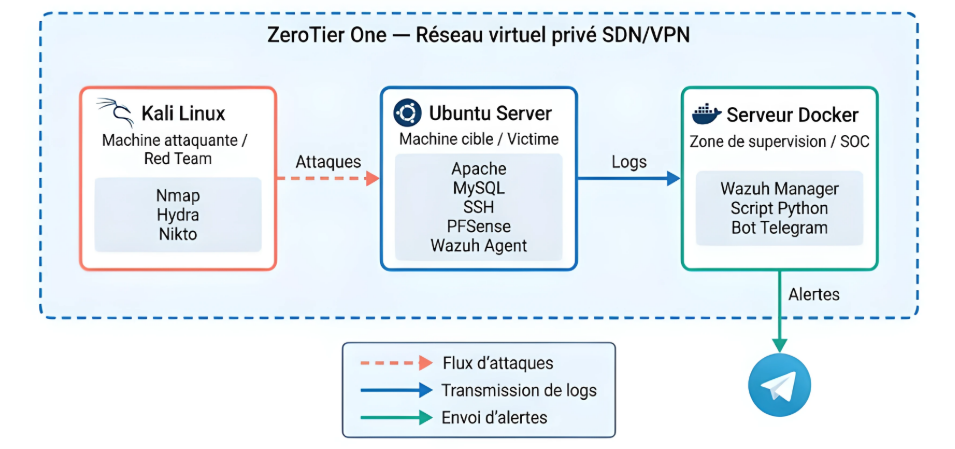
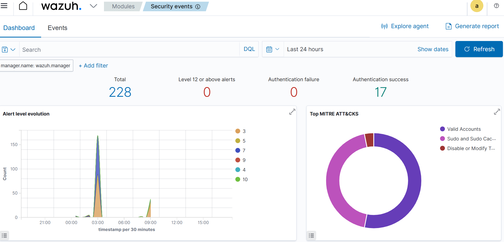
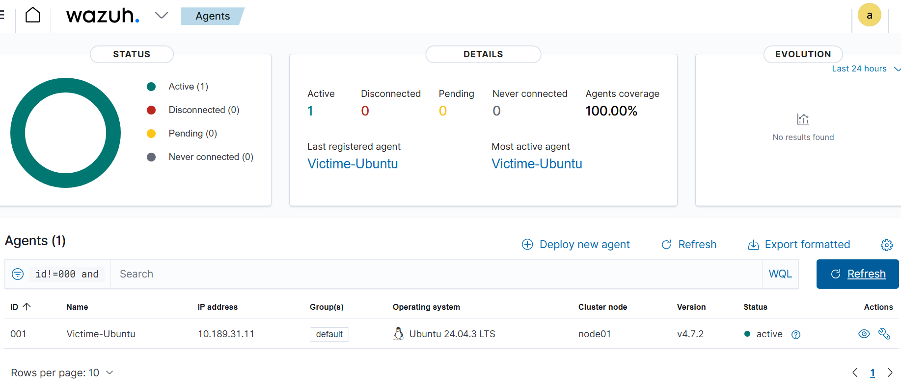
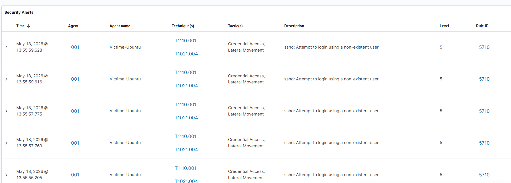
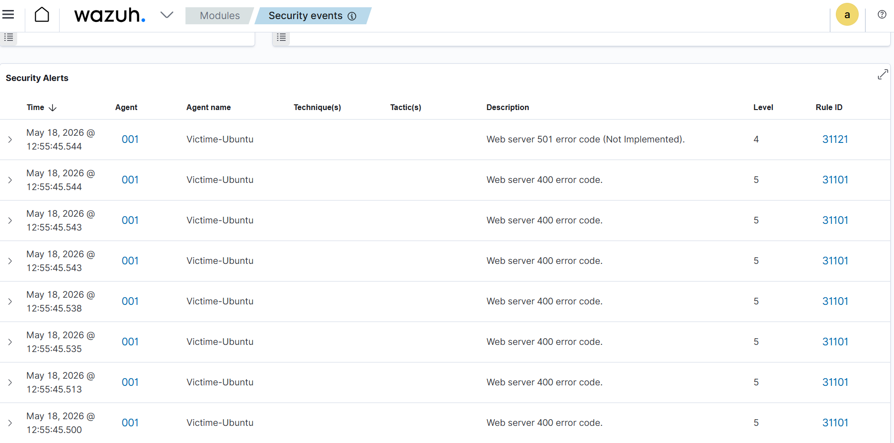
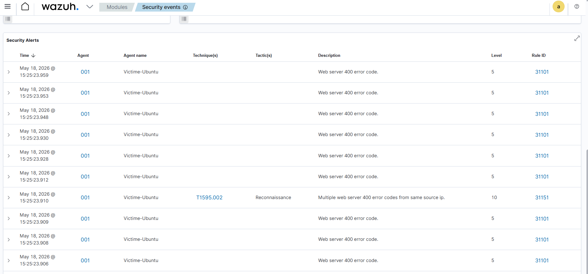
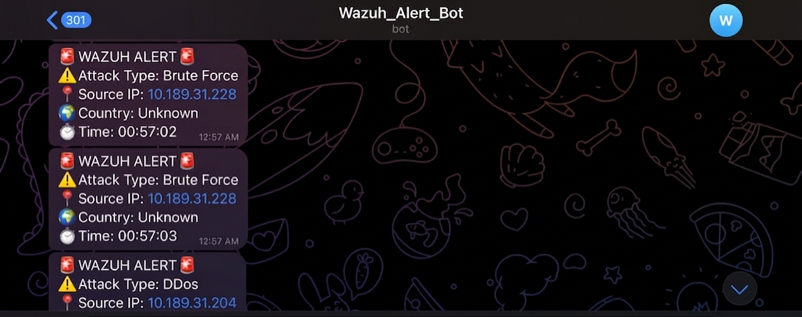

# 🛡️ Wazuh SIEM Security Monitoring Lab

A Wazuh-based Security Information and Event Management (SIEM) lab designed to monitor, detect, and investigate cybersecurity threats in a virtual enterprise environment.

---

## 📌 Overview

This project demonstrates the deployment of a centralized Security Information and Event Management (SIEM) environment using Wazuh to monitor, detect, and investigate security events in a virtual enterprise network.

The project includes:

- Deploying and configuring Wazuh SIEM
- Setting up Ubuntu Server, Kali Linux, and pfSense
- Creating a secure virtual network using ZeroTier
- Simulating real-world cyber attacks
- Monitoring and analyzing security events
- Investigating security alerts
- Sending real-time Telegram notifications

This project helped me strengthen my understanding of security monitoring, log analysis, and incident investigation while gaining practical experience with Wazuh.

---

# 🎯 Objectives

- Deploy a centralized Wazuh SIEM environment
- Monitor security events across multiple systems
- Detect malicious activities in real time
- Simulate cyber attacks in a controlled environment
- Analyze security logs
- Investigate security alerts
- Improve security visibility across the network

---

# 🏗️ Lab Architecture

The following diagram shows the architecture of the lab.



---

# 🛠️ Technologies Used

- Wazuh SIEM
- Docker
- Ubuntu Server
- Kali Linux
- pfSense
- ZeroTier
- Python
- Telegram Bot
- Linux
- MITRE ATT&CK Framework

---

# 🔴 Attack Scenarios

## SSH Brute Force Attack

**Tool:** Hydra

**Objective**

Simulate an SSH brute-force attack against the Ubuntu server.

**Detection**

Wazuh detected multiple failed SSH authentication attempts and generated security alerts.

---

## Network Reconnaissance

**Tool:** Nmap

**Objective**

Perform network reconnaissance against the target machine.

**Detection**

Wazuh detected network scanning activity and generated alerts.

---

## Web Server Enumeration

**Tool:** Nikto

**Objective**

Identify common web server vulnerabilities.

**Detection**

Wazuh monitored the generated events and detected suspicious web scanning activity.

---

# 🔍 Detection Workflow

```text
Attacker
    │
    ▼
Target Machine
    │
    ▼
System Logs
    │
    ▼
Wazuh Agent
    │
    ▼
Wazuh Manager
    │
    ▼
Security Alert
    │
    ▼
Investigation
```

---

# 📷 Screenshots

## Wazuh Dashboard



---

## Active Agents



---

## SSH Brute Force Detection



---

## Nmap Detection



---

## Nikto Detection



---

## Telegram Notification



---

# 💡 Skills Demonstrated

- SIEM Deployment
- Security Monitoring
- Threat Detection
- Log Analysis
- Incident Investigation
- Linux Administration
- Docker
- pfSense Configuration
- ZeroTier Networking

---


# 👩‍💻 Author

**Hajar Rachid**
- LinkedIn: https://linkedin.com/in/https://www.linkedin.com/in/hajar-rachid-679a8a328/
